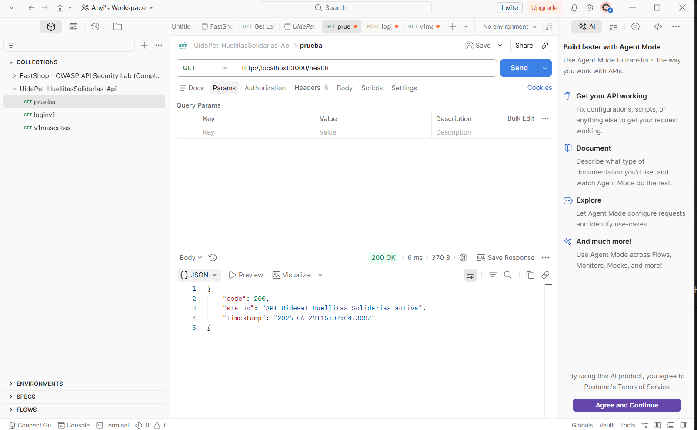
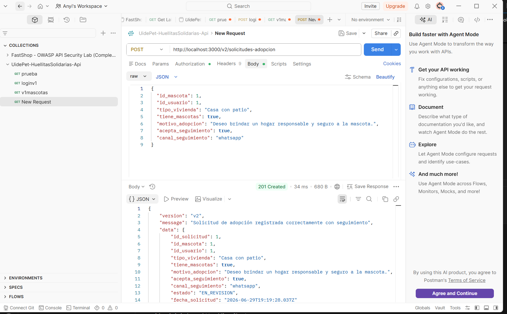
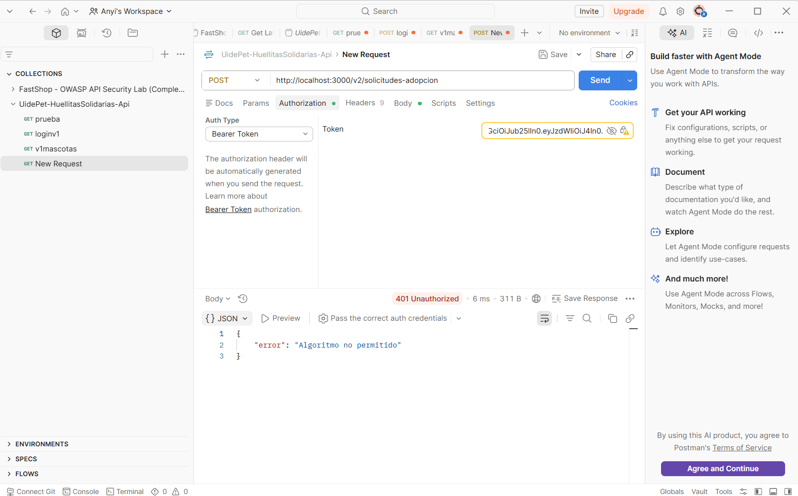

# UidePet - Huellitas Solidarias API

Este repositorio contiene el backend del proyecto **UidePet - Huellitas Solidarias**. Lo desarrolle con **Node.js, Express y TypeScript**, siguiendo la forma de trabajo vista en clases para crear una API con rutas versionadas, middlewares, autenticacion JWT y documentacion OpenAPI.

En este avance se dejaron funcionando rutas de prueba para mascotas y solicitudes de adopcion. Los datos usados son temporales, ya que el objetivo principal fue validar que la API funcione correctamente, que las rutas respondan en Postman y que la autenticacion con JWT proteja los endpoints privados.

## Instalacion

Para instalar las dependencias del proyecto se ejecuta:

```bash
npm install
```

## Variables de entorno

Para que el proyecto funcione se debe crear un archivo `.env` en la raiz del proyecto con estas variables:

```env
PORT=3000
JWT_SECRET=secreto-demo-huellitas
```

Tambien se dejo el archivo `.env.example` como referencia. El archivo `.env` real no se sube al repositorio porque contiene informacion sensible.

## Ejecucion del servidor

Para levantar el backend en modo desarrollo se usa:

```bash
npm run dev
```

El servidor se ejecuta en:

```txt
http://localhost:3000
```

Para comprobar que la API esta activa se puede probar:

```txt
GET http://localhost:3000/health
```

## Token JWT

Las rutas principales estan protegidas con JWT. Para generar un token de prueba se usa el archivo `generate-token.mjs`.

El comando es:

```bash
node generate-token.mjs
```

Luego se copia el token generado y se pega en Postman en la seccion:

```txt
Authorization -> Bearer Token
```

Con esto se pueden probar las rutas protegidas.

## Rutas implementadas

Se implemento la ruta `GET /health`, que permite verificar si el servidor esta funcionando.

Tambien se implemento `GET /v1/mascotas`, que permite listar mascotas disponibles para adopcion.

Ademas, se implemento `POST /v1/solicitudes-adopcion`, que registra una solicitud basica de adopcion.

Finalmente, se agrego `POST /v2/solicitudes-adopcion`, que registra una solicitud de adopcion con informacion adicional para seguimiento.

## Pruebas realizadas en Postman

### Prueba 1: servidor activo

Se probo la ruta:

```txt
GET http://localhost:3000/health
```

La API respondio con estado `200 OK`, confirmando que el servidor estaba funcionando correctamente.



### Prueba 2: solicitud de adopcion con token valido

Se probo la ruta:

```txt
POST http://localhost:3000/v2/solicitudes-adopcion
```

Se envio un token valido en `Authorization -> Bearer Token` y un cuerpo JSON con los datos de la solicitud.

La API respondio con estado `201 Created`, indicando que la solicitud fue registrada correctamente.



### Prueba 3: token con firma invalida

Tambien se probo un token con firma invalida para verificar que la API no acepte tokens alterados.

La respuesta fue `401 Unauthorized`, demostrando que el middleware valida la firma antes de permitir el acceso.


### Prueba 4: token con algoritmo none

Finalmente se probo un token con `alg:none`.

La API rechazo la peticion con `401 Unauthorized`, evitando que se acepte un token sin firma segura.



## Documentacion OpenAPI

Se creo el archivo:

```txt
openapi.yaml
```

En este archivo se documentaron las rutas principales de la API, los cuerpos de solicitud, las respuestas y la seguridad con Bearer Token.

Para validar la documentacion se ejecuto:

```bash
npx @redocly/cli lint openapi.yaml
```

El resultado fue valido:

```txt
Woohoo! Your API description is valid.
```

Solo aparecio un warning por el uso de `localhost`, ya que el servidor esta configurado para entorno local.

## Validacion TypeScript

Tambien se valido el proyecto con:

```bash
npx tsc --noEmit
```

El comando se ejecuto sin errores.

## Estado del avance

Hasta este punto, el backend cuenta con rutas funcionales, rutas versionadas, autenticacion JWT, validacion de tokens, documentacion OpenAPI y evidencias de pruebas realizadas en Postman.
